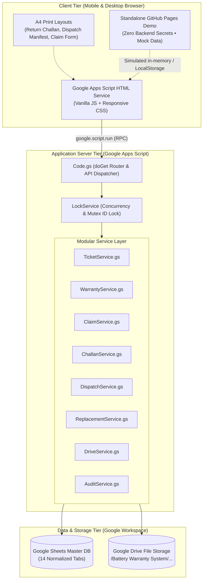
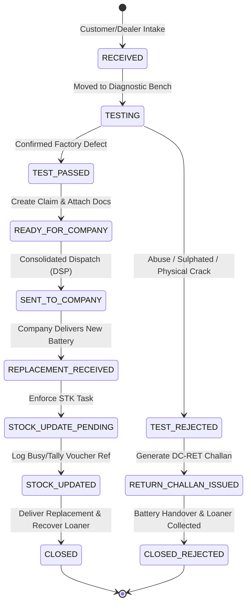

# ⚡ Battery Warranty & Claim Management System

> **Enterprise-grade, zero-cost operational platform for Indian battery distributors, service centers, and authorized dealers.**
> Built on Google Workspace (Google Sheets, Drive, Apps Script) and deployable via clasp, with a 100% client-side interactive demo for GitHub Pages.

---

## 📌 Executive Summary

Managing automotive and inverter battery warranties in India is notoriously complex. Distributors handle thousands of claims annually across brands like **Amaron**, **Exide**, **Tata Green**, **Luminous**, and **Livguard**. Key operational challenges include:
- **Lost Service/Loaner Batteries:** Temporary batteries given to customers are frequently misplaced or forgotten.
- **Lost Warranty Batteries & Serial Discrepancies:** Leading zeroes truncated by spreadsheets, causing manufacturer rejection.
- **Uncoordinated Company Dispatches:** Multi-battery consignments sent without structured LR dockets and manifests.
- **Inventory Desynchronization:** Replacement batteries received from manufacturers enter the warehouse without matching physical stock vouchers in accounting software (**Tally / Busy ERP**).

The **Battery Warranty & Claim Management System** solves these challenges using a **Free-First Architecture**—running entirely on Google Sheets (14 structured relational tabs), Google Drive (structured PDF/image repository), and Google Apps Script HTML Service.

---

## 🚀 Key Features

* **3-Way Serial Number Isolation:**
  - Strictly partitions `Original Battery Serial`, `Service (Loaner) Battery Serial`, and `Replacement Battery Serial` across all tables and forms to eliminate mix-ups.
* **Electrical & Physical Diagnostic Bench:**
  - Integrated testing workflow tracking **Open Circuit Voltage (OCV)**, **6-Cell Specific Gravity**, and **15-Second Load Test Voltage** with automatic PASS/REJECT qualification.
* **A4 Print-Ready Document Engine:**
  - Professional, GST-compliant printouts formatted specifically for standard A4 paper:
    - **Battery Return Delivery Challan (`DC-RET`):** Dual sign-off for rejected batteries.
    - **Consolidated Company Dispatch Challan (`DC-COM`):** Multi-claim consignment manifest with LR/Docket tracking.
    - **Official Warranty Inspection Slip:** Customer intake and service loaner undertaking.
* **Mandatory Accounting & Stock Reconciliation Engine:**
  - Automatically flags received replacement batteries and blocks ticket closure until an operator logs the physical stock inward voucher reference from **Busy / Tally**.
* **Zero-Cost Free-First Architecture:**
  - $0/month infrastructure cost using Google Sheets as a relational database, Google Drive for binary storage, and Google Apps Script for backend compute.
* **Source-Controlled via Google Clasp:**
  - Full local development workflow with `@google/clasp`, strict `.gitignore` guards, and modular `.gs` micro-services.

---

## 🏗️ System Architecture



---

## 🔄 Lifecycle & State Progression



---

## 📁 Repository Structure

```text
battery-warranty-manager/
├── .clasp.json.example       # Example clasp configuration
├── .gitignore                # Guards credentials and private clasp IDs
├── LICENSE                   # MIT License
├── README.md                 # System overview and portfolio documentation
├── apps-script/              # Google Apps Script source code
│   ├── appsscript.json       # GAS manifest and OAuth scopes
│   ├── Code.gs               # Main doGet router and RPC handlers
│   ├── Config.gs             # Key-value settings and sequence counters
│   ├── Database.gs           # Sheets CRUD abstraction & text-forcing
│   ├── TicketService.gs      # Intake tickets & loaner battery logic
│   ├── WarrantyService.gs    # Diagnostic tests & warranty calculation
│   ├── ClaimService.gs       # Manufacturer claim lifecycle
│   ├── ChallanService.gs     # Delivery challan generator
│   ├── DispatchService.gs    # Consolidated company dispatch batches
│   ├── ReplacementService.gs # Replacement receipt & stock reconciliation
│   ├── DriveService.gs       # Google Drive folder & upload manager
│   ├── AuditService.gs       # Immutable event audit logging
│   └── templates/            # HTML Service templates (UI & print layouts)
├── demo/                     # Standalone GitHub Pages interactive demo
│   ├── index.html            # Main single-page application interface
│   ├── styles.css            # Responsive, industrial design system & print CSS
│   └── app.js                # In-memory reactive state, search, & print simulation
└── docs/                     # Comprehensive engineering documentation
    ├── architecture.md       # Technical design and architectural decisions
    ├── deployment.md         # Administrator guide for Sheets, Drive, & Clasp
    ├── sheet-schema.md       # 14-tab relational schema definitions
    └── workflow.md           # State machines, transition tables, & diagrams
```

---

## 🛠️ Deployment & Quick Start

For detailed administrator instructions on setting up Google Sheets, Drive folders, Script Properties, and Clasp push, refer to:
👉 **[Administrator Deployment Guide (docs/deployment.md)](docs/deployment.md)**

### Local Clasp Sync
```bash
# 1. Install Google Clasp
npm install -g @google/clasp

# 2. Login to Google
clasp login

# 3. Configure your project
cp .clasp.json.example .clasp.json
# Edit .clasp.json and enter your Script ID

# 4. Push code to Google Apps Script
clasp push
```

---

## 💻 Standalone Interactive Demo (GitHub Pages)

The `/demo` folder contains a **100% self-contained client-side simulation** of the complete system:
* Pre-loaded with realistic Indian battery distributor data (**Amaron, Exide, Tata Green**).
* Full ticket intake simulation with service battery loaner issuance.
* Diagnostic test bench simulator (OCV, Specific Gravity, 15s Load Test).
* Consolidated company dispatch batch creator with LR/Docket assignment.
* Replacement battery receiving with **mandatory Busy/Tally stock reconciliation task**.
* **Print Center:** Authentic, A4-formatted Delivery Challans (`DC-RET`, `DC-COM`) and Claim Forms ready for direct browser printing.
* **Zero Backend Secrets:** Runs locally by double-clicking `demo/index.html` or directly on GitHub Pages without API keys or credentials.

To preview locally:
```bash
# Open in your default browser
open demo/index.html
```

---

## 📄 License
This project is licensed under the [MIT License](LICENSE).
