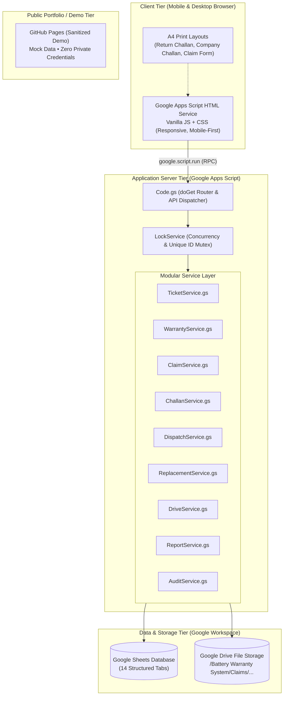

# Battery Warranty & Claim Management System — Architecture

## 1. System Overview

The **Battery Warranty & Claim Management System** is an enterprise-grade, zero-cost operational platform designed for Indian battery distributors, service centers, and dealers. It manages the complete lifecycle of battery warranty claims—from customer intake and battery testing to company dispatch, replacement receipt, and manual stock reconciliation.

The system is engineered around a **Free-First Architecture**, leveraging Google Workspace services (Google Apps Script, Google Sheets, Google Drive) and GitHub (Source control, clasp, and GitHub Pages for public portfolio demo) to achieve **zero ongoing operational infrastructure cost**.



---

## 2. Free-First Architecture Breakdown

| Layer | Technology | Free Tier Limits & Strategy |
| :--- | :--- | :--- |
| **Frontend** | HTML5, CSS3, Vanilla JavaScript (GAS HTML Service) | Unlimited bandwidth within Google Apps Script limits; no frontend framework bloat. |
| **Backend** | Google Apps Script (V8 Runtime) | 6 min execution/call, 20,000 URL fetch calls/day, 90 min total compute/day. Generous for distributor scale. |
| **Database** | Google Sheets | 10 million cells per spreadsheet. Targeted range reads, batched writes, and in-memory indexing prevent slowdowns. |
| **File Storage**| Google Drive | 15 GB free tier per Google Account. Documents stored in organized folders with permissions inherited from owner. |
| **Concurrency**| GAS `LockService.getScriptLock()` | 30-second lock timeouts prevent race conditions during ticket/claim/challan ID creation. |
| **Version Control**| GitHub & `@google/clasp` | Git repository for change management; clasp pushes local source code directly into Apps Script. |
| **Public Demo**| GitHub Pages | Free static hosting for a sanitized, client-side demo with mock Indian battery distributor data. |

---

## 3. Google Drive Storage Hierarchy

Document binary data is **never stored in Google Sheets**. Google Drive stores uploaded and generated documents with structured, deterministic file paths:

```text
Google Drive Root
└── Battery Warranty System/
    ├── Claims/
    │   ├── CLM-2026-000001/
    │   │   ├── Documents/
    │   │   │   ├── CLM-2026-000001_Invoice.pdf
    │   │   │   ├── CLM-2026-000001_WarrantyCard.jpg
    │   │   │   └── CLM-2026-000001_TestReport.pdf
    │   │   └── Generated Documents/
    │   │       └── CLM-2026-000001_ClaimForm.pdf
    │   └── CLM-2026-000002/
    ├── Delivery Challans/
    │   ├── DC-RET-2026-000001.pdf
    │   └── DC-COM-2026-000001.pdf
    ├── Company Dispatches/
    │   └── DSP-2026-000001_Manifest.pdf
    └── Backups/
```

---

## 4. Concurrency & Data Integrity Strategy

1. **`LockService` Concurrency Control:**
   * Critical ID generation (`TKT-YYYY-XXXXXX`, `CLM-YYYY-XXXXXX`, `DC-RET-YYYY-XXXXXX`, `DSP-YYYY-XXXXXX`) runs within a synchronized block using `LockService.getScriptLock().waitLock(30000)`.
   * Sequential numbering never uses "row count + 1". It parses the active configuration sequence counters stored safely in the database with fallback to atomic max-sequence scans.

2. **Serial Number Integrity (Text Forcing):**
   * Battery serial numbers frequently contain leading zeros (e.g. `0048192837`).
   * In Google Sheets, cells are prepended with an apostrophe `'` or formatted strictly as `@` (Text format) to guarantee zero truncation or floating-point rounding.

3. **Separation of Battery Entities:**
   * **Original Battery Serial:** The battery surrendered by customer or dealer.
   * **Service Battery Serial:** A temporary loaner battery provided to the customer during claim processing.
   * **Replacement Battery Serial:** The new battery supplied by the manufacturer/company upon warranty approval.
   * *These 3 identifiers are strictly isolated across all database schemas.*

4. **Immutable Audit Trail:**
   * Every creation, status transition, override, and document upload records an append-only row in `Audit_Log` containing timestamp (`Asia/Kolkata`), user, action, old status, and new status.
