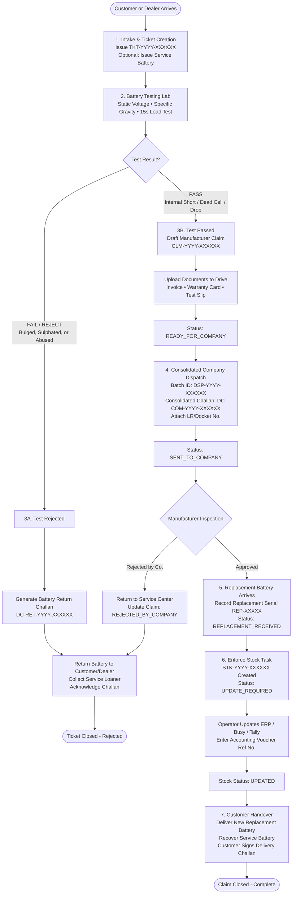
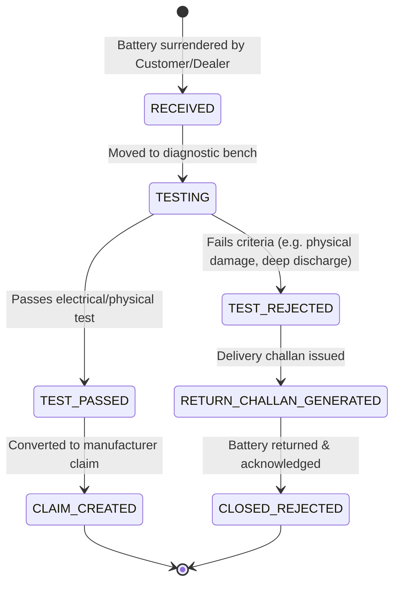
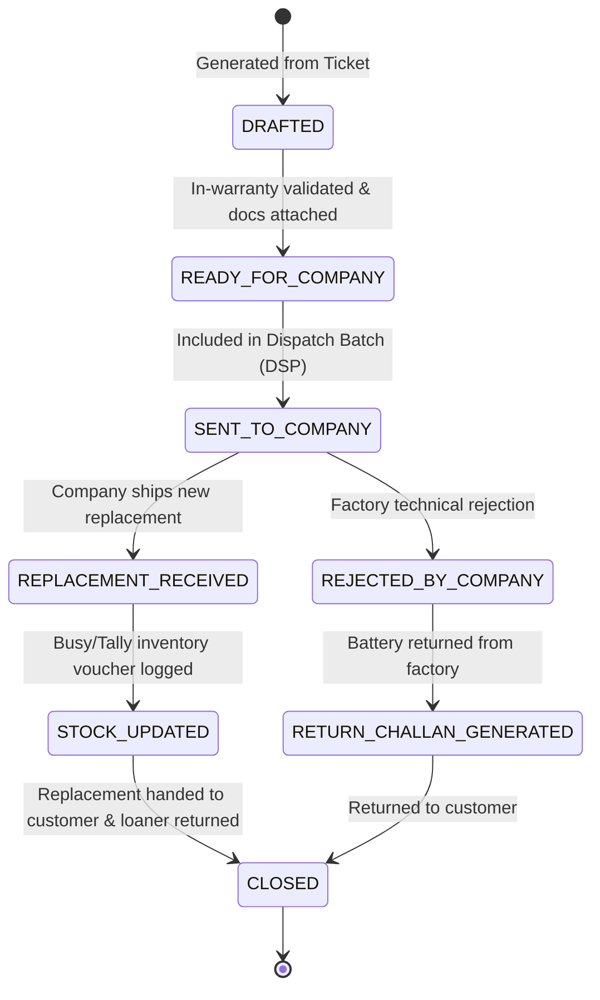
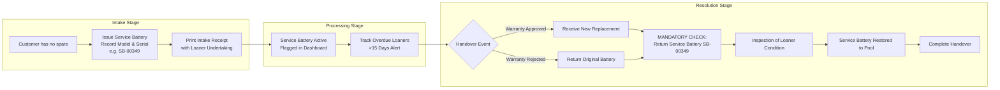
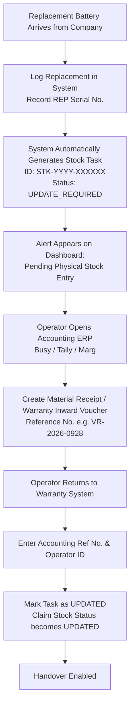

# Battery Warranty & Claim Management System — Workflow & State Machine

## 1. Lifecycle Overview

The Battery Warranty & Claim Management System coordinates five interconnected lifecycles:
1. **Intake Ticket Lifecycle:** From battery surrender to diagnostic conclusion.
2. **Battery Testing Lifecycle:** Electrical and physical diagnostics determining eligibility.
3. **Manufacturer Claim Lifecycle:** Consolidated dispatch to factory/depot and replacement tracking.
4. **Service (Loaner) Battery Lifecycle:** Temporary loaner issuance and recovery.
5. **Stock Reconciliation Lifecycle:** Mandatory inventory ERP alignment upon replacement receipt.

---

## 2. End-to-End Workflow Diagram

---

## 3. Ticket State Machine

### Ticket Status Matrix

| Status | Description | Allowed Actions | Next Valid States |
| :--- | :--- | :--- | :--- |
| `RECEIVED` | Intake created. Original battery in holding bay. Loaner battery recorded if issued. | Edit notes, assign technician, start testing | `TESTING`, `CANCELLED` |
| `TESTING` | Battery connected to load tester and hydrometer. | Record test parameters (OCV, Gravity, Load V) | `TEST_PASSED`, `TEST_REJECTED` |
| `TEST_PASSED` | Diagnostic test completed; defect confirmed eligible under warranty terms. | Create Claim (`CLM-YYYY-XXXXXX`) | `CLAIM_CREATED` |
| `TEST_REJECTED`| Battery failed warranty eligibility (abused, uncharged, physical crack). | Generate Return Challan (`DC-RET`) | `RETURN_CHALLAN_GENERATED` |
| `RETURN_CHALLAN_GENERATED` | Return challan printed. Awaiting customer pickup. | Handover battery, collect loaner, sign challan | `CLOSED_REJECTED` |
| `CLAIM_CREATED` | Official manufacturer claim generated; ticket archived into claim. | Manage under Claim lifecycle | (Controlled by Claim lifecycle) |
| `CLOSED_REJECTED` | Battery returned to customer. Service loaner returned. Final state. | View only | Terminal |

---

## 4. Manufacturer Claim State Machine

### Claim Status Matrix

| Status | Trigger Condition | Mandatory Fields Required |
| :--- | :--- | :--- |
| `DRAFTED` | Created from `TEST_PASSED` ticket | `ticket_no`, `original_serial_no`, `battery_model`, `customer_name` |
| `READY_FOR_COMPANY` | Warranty validity verified; documents uploaded | `warranty_status`, `date_of_sale`, `warranty_expiry_date` |
| `SENT_TO_COMPANY` | Added to consolidated dispatch batch | `dispatch_batch_no`, `company_challan_no`, `company_dispatch_date`, `carrier_transporter` |
| `REPLACEMENT_RECEIVED`| New replacement battery arrives at distributor | `replacement_model`, `replacement_serial_no`, `replacement_received_date` |
| `REJECTED_BY_COMPANY`| Manufacturer warranty engineer rejects claim | `remarks` explaining factory rejection |
| `CLOSED` | Replacement delivered, service battery collected, stock updated | `stock_status = UPDATED`, `closed_date` |

---

## 5. Service (Loaner) Battery Protocol

To prevent lost loaner inventory, the system enforces a strict 2-key loaner lifecycle:

### Loaner Rules
1. **Serial Number Isolation:** Service battery serial number is strictly stored in `service_battery_serial` and NEVER copied into `original_serial_no` or `replacement_serial_no`.
2. **Release Blocker:** A claim or ticket cannot be marked `CLOSED` while `service_battery_issued = TRUE` until the return checklist is confirmed.
3. **Overdue Tracking:** Any loaner issued for more than 14 business days without an active company dispatch is highlighted in amber/red on the administrative dashboard.

---

## 6. Stock Reconciliation Lifecycle

When a warranty replacement battery is received from the manufacturer, it constitutes physical inventory entering the warehouse. Without explicit ERP reconciliation, the distributor's inventory system (Busy, Tally, Marg, or SAP) suffers discrepancy.

### Stock Update Validation Rules
* **No Premature Handover:** An operator cannot mark a claim `CLOSED` unless `stock_status` is `UPDATED`.
* **Voucher Audit:** The accounting voucher number (`accounting_ref_no`) is immutable once logged and indexed in the audit trail.
